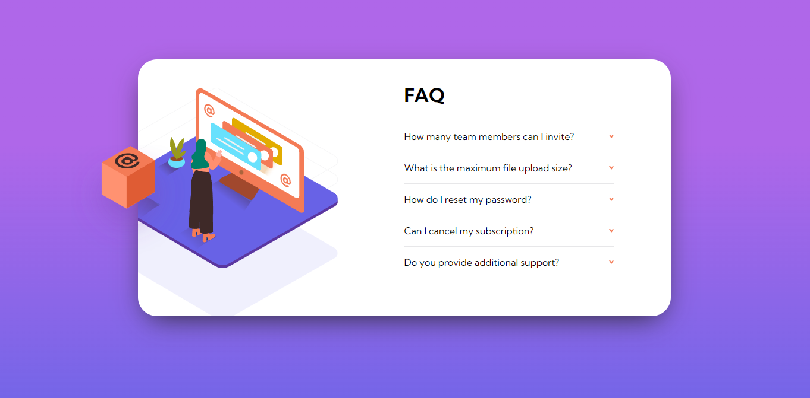

# Frontend Mentor - FAQ accordion card solution

This is a solution to the [FAQ accordion card challenge on Frontend Mentor](https://www.frontendmentor.io/challenges/faq-accordion-card-XlyjD0Oam). Frontend Mentor challenges help you improve your coding skills by building realistic projects. 

## Overview

### The challenge

Users should be able to:

- View the optimal layout for the component depending on their device's screen size
- See hover states for all interactive elements on the page
- Hide/Show the answer to a question when the question is clicked

### Screenshot

### Links

- Solution URL: [here](https://github.com/zdenman/FAQ-accordion-card)
- Live Site URL: [here](https://faq-accordion-card-red-sigma.vercel.app/)

## My process

### Built with

- Semantic HTML5 markup
- CSS custom properties
- Flexbox

### What I learned

Learned how to organise images to be some overflow: hidden and some not. Started to be pretty comfortable with flexbox. Still strugling with JS, a followed tutorials on YouTube to write this javaScript. Trying to learn as much as possible. Working hard to be able to write JS by myself.

## Author

- Frontend Mentor - [@zdenman](https://www.frontendmentor.io/profile/zdenman)

## Acknowledgments

To create accordion in javaScript this two tutorials helped me alot. Thank you!
- Accordion tutorial on YouTube by [CodeJourney](https://www.youtube.com/watch?v=dr8Emho-kYo&t=1206s&ab_channel=CodingJourney)
- Accordion tutorial on YouTube by [John Komarnicki](https://www.youtube.com/watch?v=nMbtxsNwu1A&ab_channel=JohnKomarnicki)

